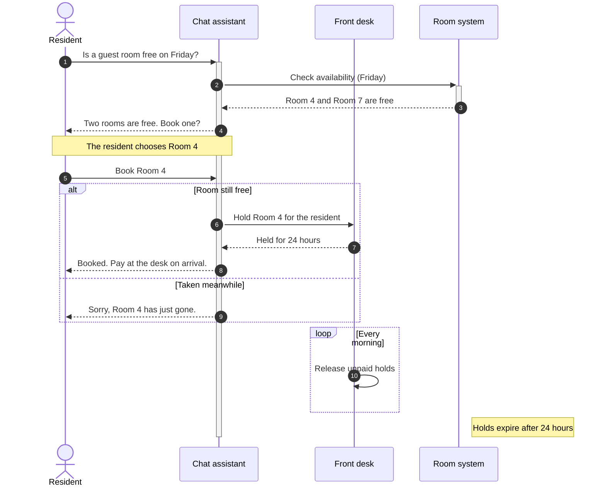
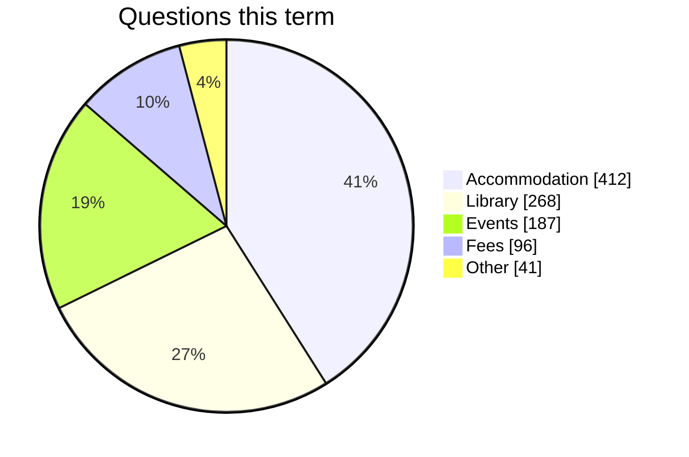
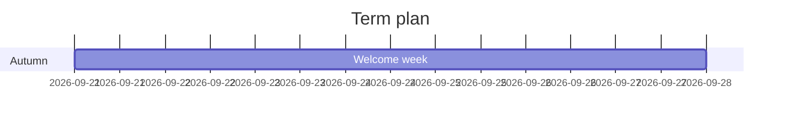

## Booking a guest room

How a resident's booking travels through the College's systems:

```mermaid
sequenceDiagram
    autonumber
    actor Resident
    participant Chat as Chat assistant
    participant Desk as Front desk
    participant Rooms as Room system

    Resident->>+Chat: Is a guest room free on Friday?
    Chat->>+Rooms: Check availability (Friday)
    Rooms-->>-Chat: Room 4 and Room 7 are free
    Chat-->>Resident: Two rooms are free. Book one?
    Note over Resident,Chat: The resident chooses Room 4
    Resident->>Chat: Book Room 4
    alt Room still free
        Chat->>Desk: Hold Room 4 for the resident
        Desk-->>Chat: Held for 24 hours
        Chat-->>Resident: Booked. Pay at the desk on arrival.
    else Taken meanwhile
        Chat-->>Resident: Sorry, Room 4 has just gone.
    end
    loop Every morning
        Desk->>Desk: Release unpaid holds
    end
    Note right of Rooms: Holds expire after 24 hours
    deactivate Chat
```

## Where the questions come from

```mermaid
pie showData
    title Questions this term
    "Accommodation" : 412
    "Library" : 268
    "Events" : 187
    "Fees" : 96
    "Other" : 41
```

## Kinds Mermaid can draw that the chat shows as code

```mermaid
gantt
    title Term plan
    section Autumn
    Welcome week :a1, 2026-09-21, 7d
```
